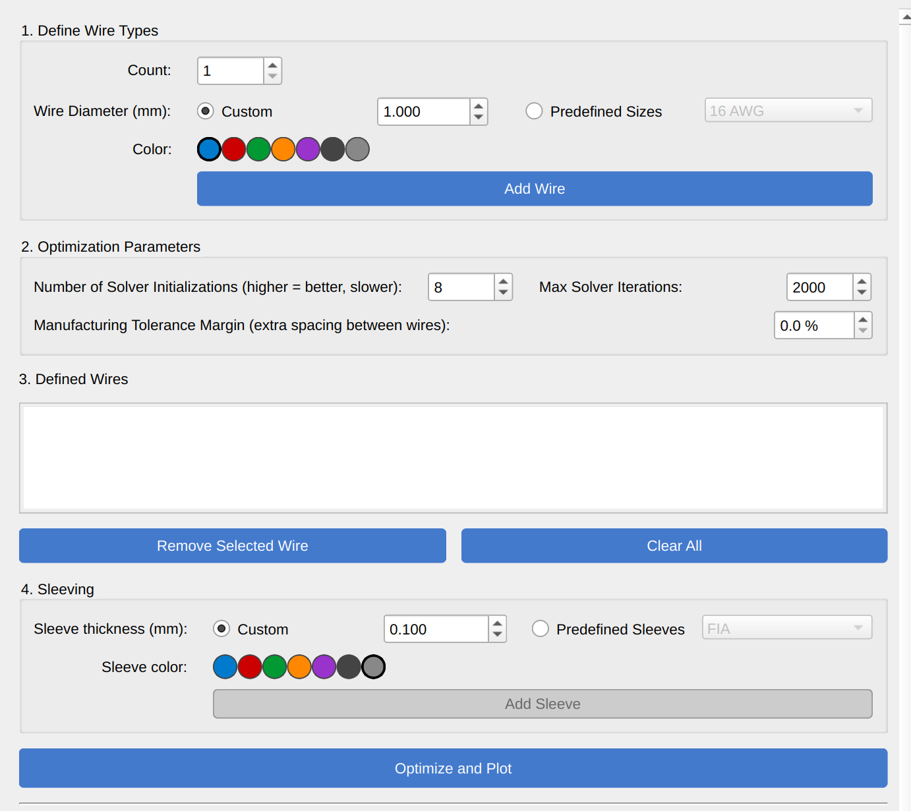
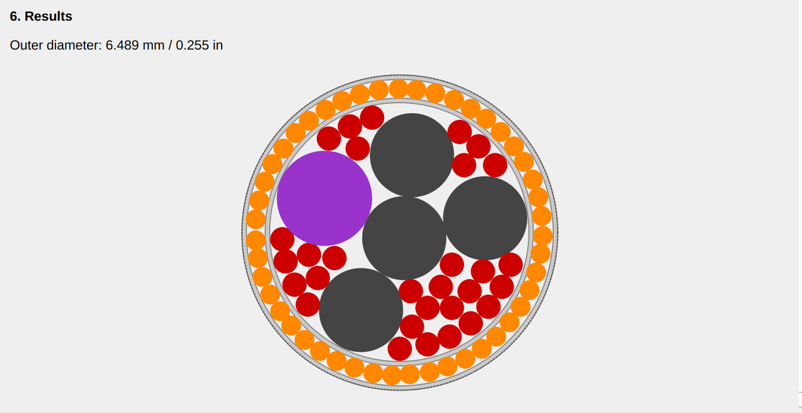

# 🚀 Wire Bundle Optimizer

A Python/PyQt6 app to **pack circular wires** (with arbitrary diameters) into the **smallest possible circular bundle**.  
It supports multi-start optimization, shielding layers, and live plotting.

---

## Index

1. [Features](#features)
2. [Installation & Run](#installation--run)
3. [UI Walkthrough](#ui-walkthrough)
4. [Predefined Sizes (`wire_types.yaml`)](#predefined-sizes-wire_typesyaml)
5. [How it Works (Math)](#how-it-works-math)
6. [Tips & Troubleshooting](#tips--troubleshooting)
7. [Screenshots](#screenshots)

---

## Features

-   Define any number of wire types (custom or from **predefined sizes** via YAML).
-   **Color-coded** wires.
-   **Manufacturing margin** (percentage) inflates radii to enforce spacing.
-   **Multi-start SLSQP** with parallel runs to escape local minima.
-   **Inner exclusion** constraint from prior shields (no wire can cross a shield).
-   Live plot:
    -   Wires placement
    -   Dashed current outer boundary
    -   Grey shield rings

---

## Installation & Run

You can run the app in two ways:

### Option 1: Using [uv](https://github.com/astral-sh/uv) (recommended)

```bash
uv run main.py
```

This automatically manages a virtual environment and dependencies.

### Option 2: Using pip

First install dependencies:

```bash
pip install PyQt6 numpy scipy joblib pyyaml
```

Then run:

```bash
python main.py
```

---

## UI Walkthrough

1. **1. Define Wire Types**

    - Set **Count** and **Wire Diameter**:

        - **Custom**: enter diameter in mm.
        - **Predefined Sizes**: pick a label defined in `wire_types.yaml`.

    - Pick a **Color** and click **Add Wire**.
      Identical (color + diameter) entries merge counts automatically.

2. **2. Optimization Parameters**

    - **Number of Solver Initializations**: more restarts → better layout, slower.
    - **Max Solver Iterations**: SLSQP cap per run.
    - **Manufacturing Tolerance Margin**: extra spacing (percent) added to radii.

3. **3. Defined Wires**

    - Shows the current working set.
    - **Remove Selected Wire** or **Clear All** (clears wires, layers, and results).

4. **4. Shielding**

    - Set **Shield thickness** (mm).
    - **Add Shielding** is enabled **only after** a successful optimize.
      When clicked:

        - The current optimized bundle becomes a **locked layer** with a shield of the given thickness.
        - The **inner exclusion radius** is updated.
        - The working wire list is cleared for defining the **next ring**.

5. **Optimize and Plot**

    - Runs the multi-start optimizer and updates:

        - Plot (including historic layers)
        - Outer **diameter** in **mm** and **inches**.

6. **Results**

    - The plot is centered and scaled to fit.
    - The window is **scrollable** if content exceeds the viewport.

---

## Predefined Sizes (`wire_types.yaml`)

Place this file next to `main.py`. It maps **labels → diameter (mm)**:

```yaml
# Example — adapt to your catalog
"16 AWG": 1.291
"18 AWG": 1.024
"20 AWG": 0.812
"1.00 mm": 1.000
"0.90 mm": 0.900
"Ethernet": 2.000
```

In the UI, choose **Predefined Sizes** to select one of these keys.

---

## How it Works (Math)

Minimize the enclosing radius $R$ of a circle containing all wire disks.

**Variables**

-   Centers $(x_i, y_i)$ for $i = 1..n$
-   Outer radius $R$

**Effective radii**  
$r_i^{\mathrm{eff}} = r_i \(1 + m)$ where $m$ is the **margin**.

**Constraints**

1. **Containment**:  
   $\|c_i\| + r_i^{\mathrm{eff}} \le R$

2. **Non-overlap**:  
   $\|c_i - c_j\| \ge r_i^{\mathrm{eff}} + r_j^{\mathrm{eff}}$

3. **Frozen core (from shields)**:  
   $\|c_i\| \ge R_{\text{core}} + r_i^{\mathrm{eff}}$

**Objective**  
Minimize $R$

---

## Tips & Troubleshooting

-   If optimization is slow, reduce **initializations** or **max iterations**.
-   If wires overlap visually, increase **margin** a bit (e.g., 1–3%).
-   **Add Shielding** stays disabled until a valid solution is available.
-   **Clear All** resets everything (wires, layers, results, frozen core).

## Screenshots

### Main UI

This is the main window where you define wires, optimization parameters, and shielding layers:



---

### Result

After optimization and adding shielding, the layout will look like this:


